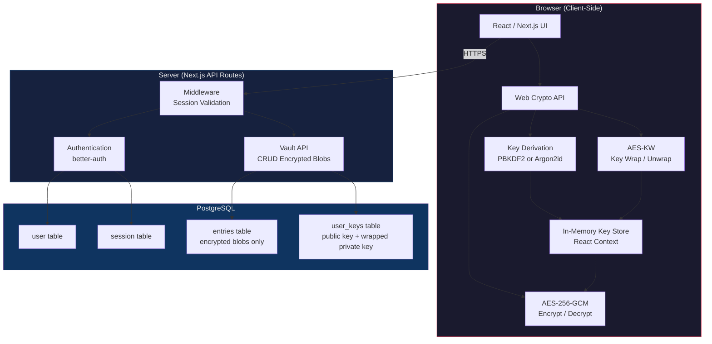
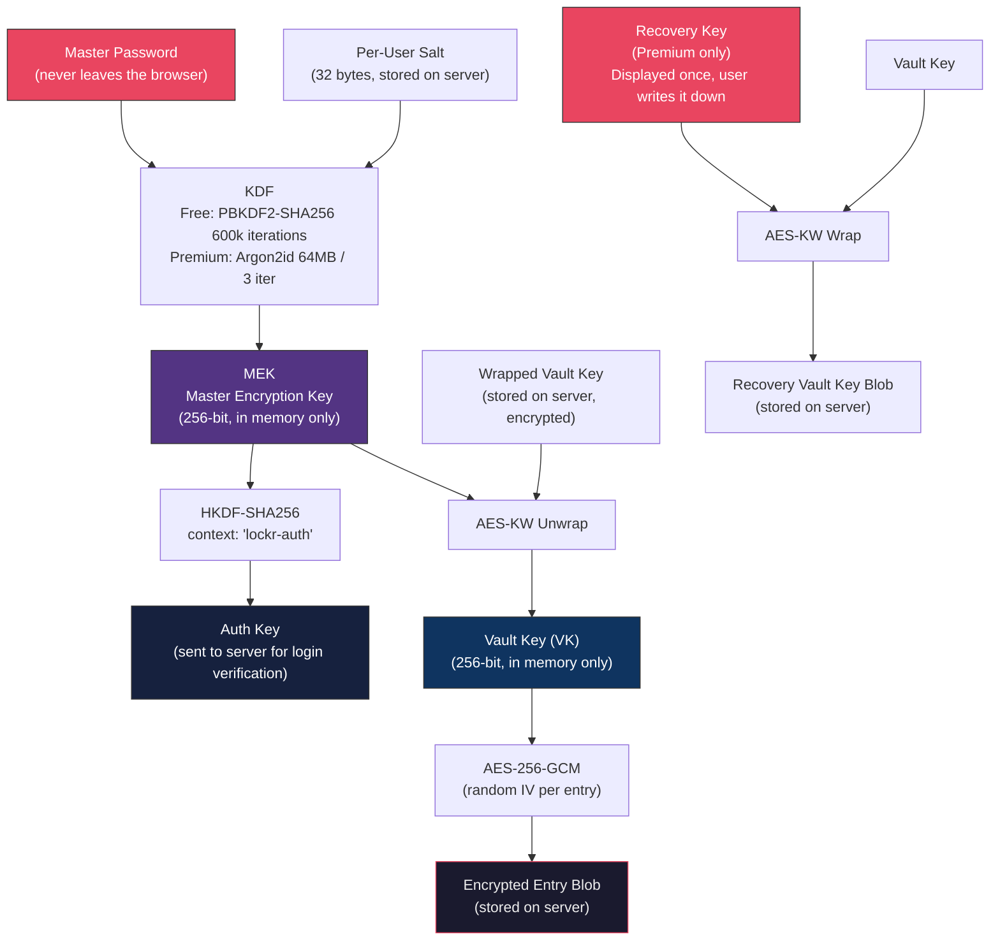
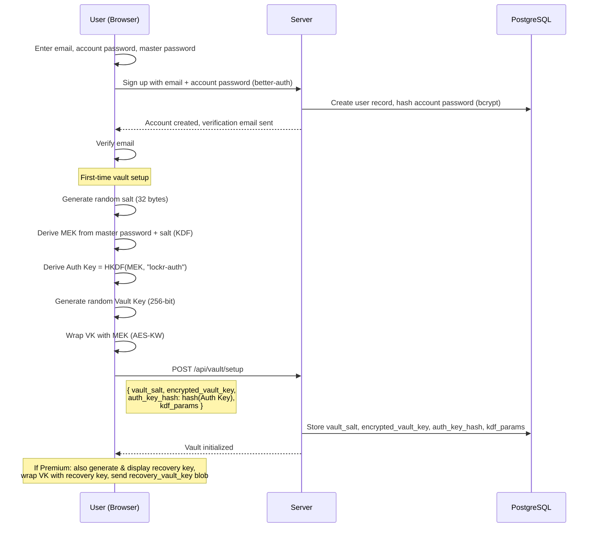
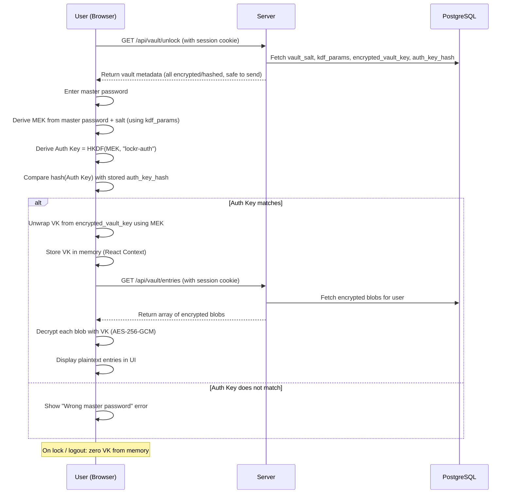
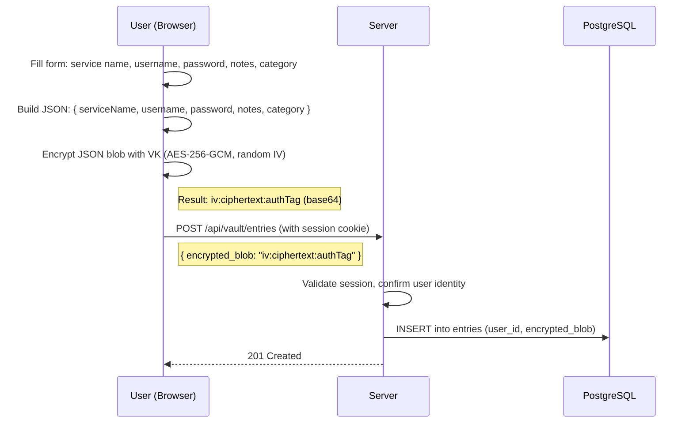
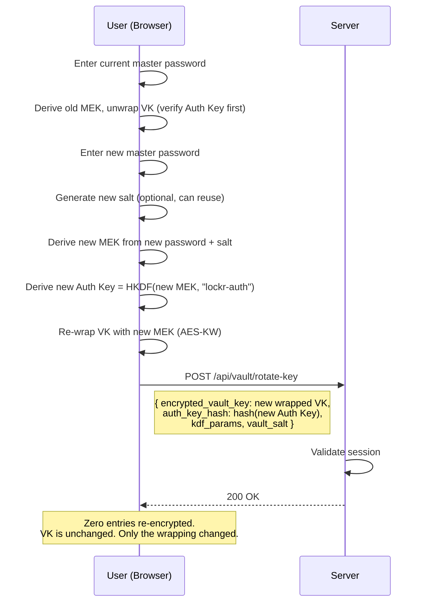
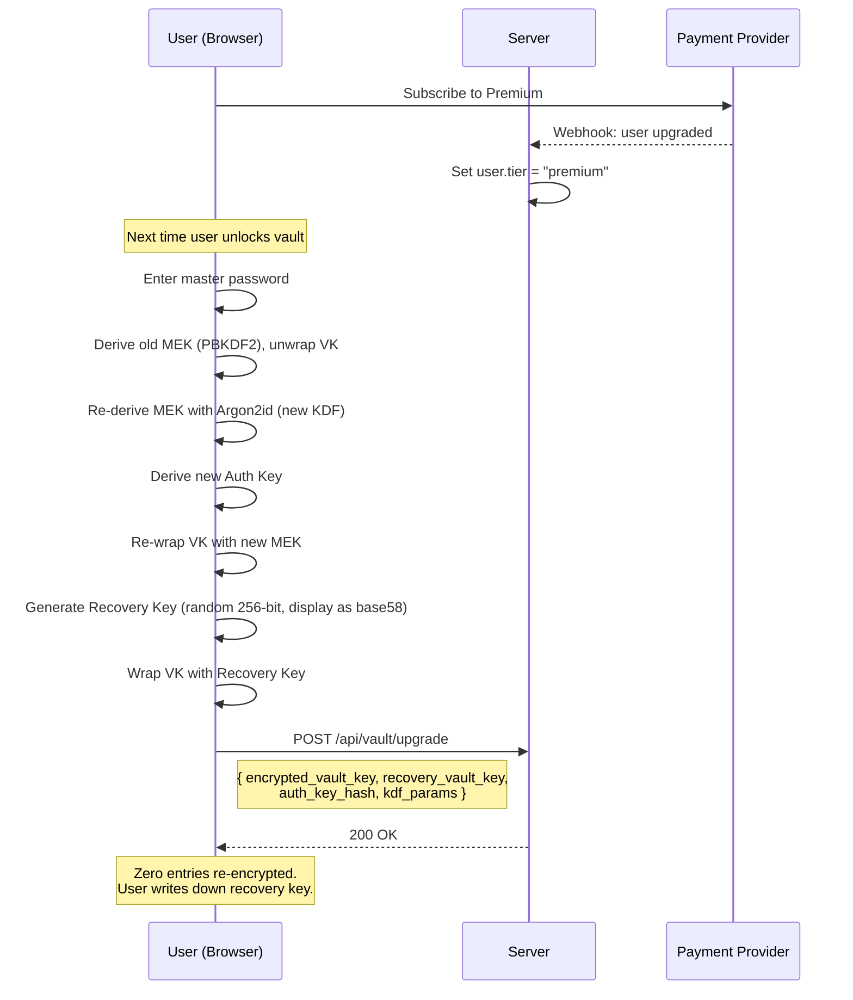

# Lockr -- Architecture & Product Overview

## What is Lockr?

Lockr is an end-to-end encrypted password manager built as a SaaS product. The server never has access to user passwords or vault contents in plaintext. All encryption and decryption happens client-side in the browser using the Web Crypto API.

Lockr uses a **vault key architecture** where a randomly generated Vault Key encrypts all entries, and the user's master password protects that Vault Key. This means changing your master password is instant (re-wrap one key) rather than re-encrypting every stored entry.

---

## System Overview

---

## Key Hierarchy

The core of Lockr's security model. Both tiers use this same structure.

**Key principle:** The server stores `Wrapped Vault Key` and `Encrypted Entry Blobs`. It cannot decrypt either without the MEK, which is derived from the master password, which never leaves the browser.

---

## Sign-Up Flow

---

## Unlock & Decrypt Flow

---

## Save Entry Flow

---

## Master Password Change Flow

---

## Tier Upgrade Flow

---

## Tier Comparison

### Vault & Storage

| Feature | Free | Premium |
|---------|:----:|:-------:|
| Encrypted vault entries | 50 | Unlimited |
| Personal vault | Yes | Yes |
| Encrypted notes (API keys, Wi-Fi, secure text) | 5 | Unlimited |
| Encrypted file attachments | -- | 1 GB |
| Custom categories and tags | 3 custom | Unlimited |
| Password history (previous versions per entry) | -- | Last 25 versions |
| Trash / recently deleted (30-day recovery) | -- | Yes |

### Security & Encryption

| Feature | Free | Premium |
|---------|:----:|:-------:|
| End-to-end encryption (AES-256-GCM + Vault Key) | Yes | Yes |
| Key Derivation Function | PBKDF2 (600k iter) | Argon2id (memory-hard) |
| Recovery key (master password backup) | -- | Yes |
| Vault health report | Score only | Full breakdown + suggestions |
| Breach monitoring (HaveIBeenPwned) | -- | Continuous + email alerts |
| 2FA for Lockr account (TOTP) | Yes | Yes |
| 2FA for Lockr account (FIDO2 / hardware keys) | -- | Yes |

### Convenience & Productivity

| Feature | Free | Premium |
|---------|:----:|:-------:|
| Password generator | Basic | Advanced (passphrase, rules) |
| Built-in TOTP authenticator | -- | Yes |
| Browser extension | Yes | Yes |
| Active sessions / devices | 2 | Unlimited |
| Autofill | Yes | Yes |
| Secure sharing (one-to-one with another Lockr user) | -- | 5 active shares |
| Import from other password managers | Yes | Yes |
| Export vault (encrypted backup) | Yes | Yes |

### Support

| Feature | Free | Premium |
|---------|:----:|:-------:|
| Community support | Yes | Yes |
| Email support | -- | Priority |
| Early access to new features | -- | Yes |

### Future: Family Plan

| Feature | Family |
|---------|:------:|
| Up to 6 members | Yes |
| Shared collections with per-member permissions | Yes |
| Emergency access (trusted contact, time-delayed) | Yes |
| Family admin dashboard | Yes |
| Activity log for shared vaults | Yes |

---

## What the Server Stores vs. What It Knows

This is the zero-knowledge guarantee.

| Data | Stored on Server | Server Can Read It |
|------|:---:|:---:|
| Email, name | Yes | Yes |
| Account password (bcrypt hash) | Yes | No (hashed) |
| Master password | **No** | **Never sent** |
| Vault salt | Yes | Yes (not secret, per-user randomness) |
| KDF parameters | Yes | Yes (not secret, algorithm config) |
| Auth Key hash | Yes | Yes (used for verification, cannot reverse to MEK) |
| Wrapped Vault Key | Yes | No (encrypted with MEK) |
| Recovery Vault Key blob | Yes | No (encrypted with recovery key) |
| Encrypted entry blobs | Yes | No (encrypted with VK) |
| Entry metadata (service name, username, notes) | **No** (inside encrypted blob) | No |
| Public key (for future sharing) | Yes | Yes (public by design) |
| Wrapped private key | Yes | No (encrypted with MEK) |

---

## Tech Stack

| Layer | Technology |
|-------|-----------|
| Frontend | Next.js 15, React 19, TypeScript, Tailwind CSS, shadcn/ui |
| Client-side crypto | Web Crypto API (SubtleCrypto) -- native, no polyfills |
| Premium KDF | Argon2id via WASM (hash-wasm) |
| Authentication | better-auth (session-based, secure cookies) |
| Database | PostgreSQL (via Drizzle ORM) |
| Email | Resend |
| Deployment | Vercel (frontend) + managed PostgreSQL |
| Payments | Stripe (future) |

---

## Security Properties

1. **End-to-end encrypted** -- the server stores only ciphertext and cannot decrypt vault contents
2. **Zero-knowledge authentication** -- the server verifies an Auth Key derivative, never the master password itself
3. **Per-user salt** -- identical master passwords produce different keys for different users
4. **Authenticated encryption** -- AES-256-GCM provides both confidentiality and integrity (tamper detection)
5. **Key hierarchy** -- master password change is O(1), not O(n) entries
6. **Memory-only key storage** -- VK and MEK live in JavaScript memory, not localStorage, not cookies, not IndexedDB
7. **Forward secrecy on lock** -- when the vault is locked, key material is zeroed; re-entry of master password is required to decrypt again
