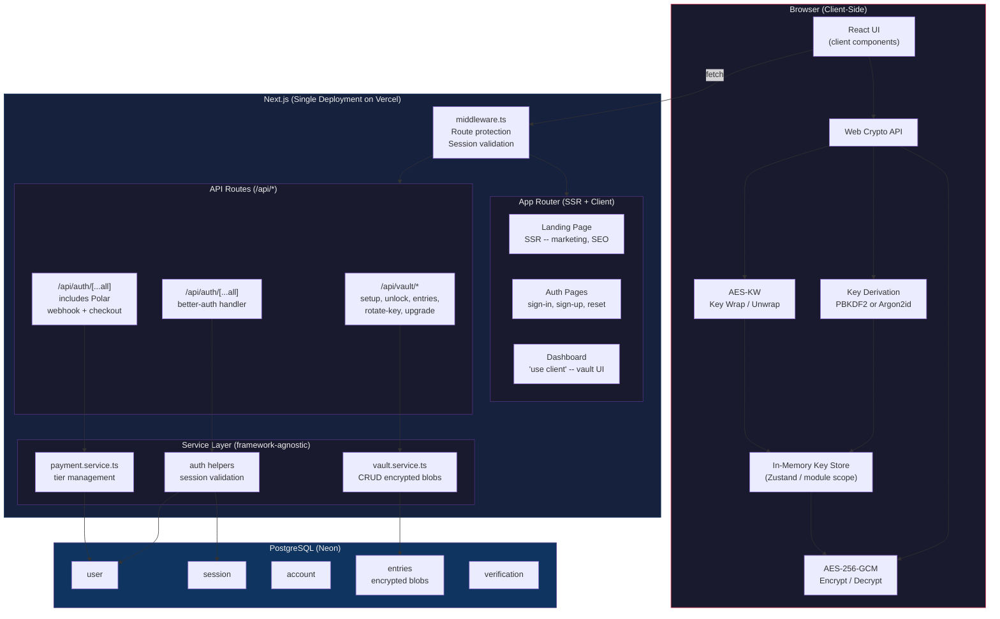
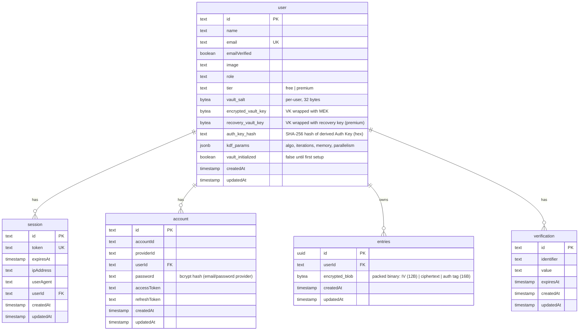
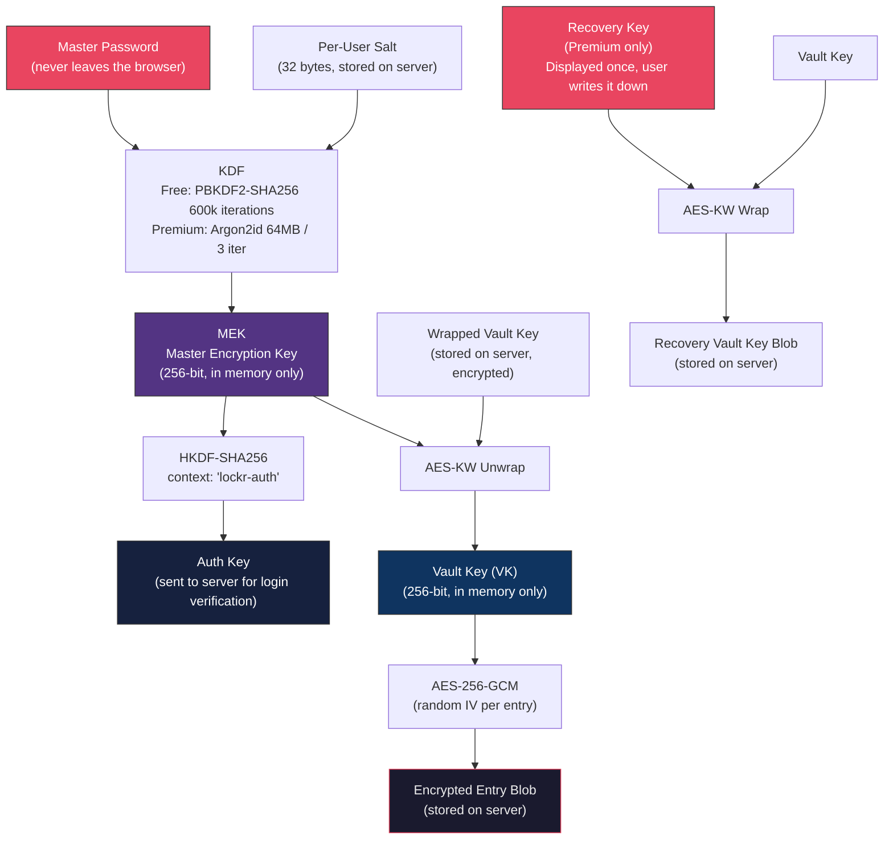
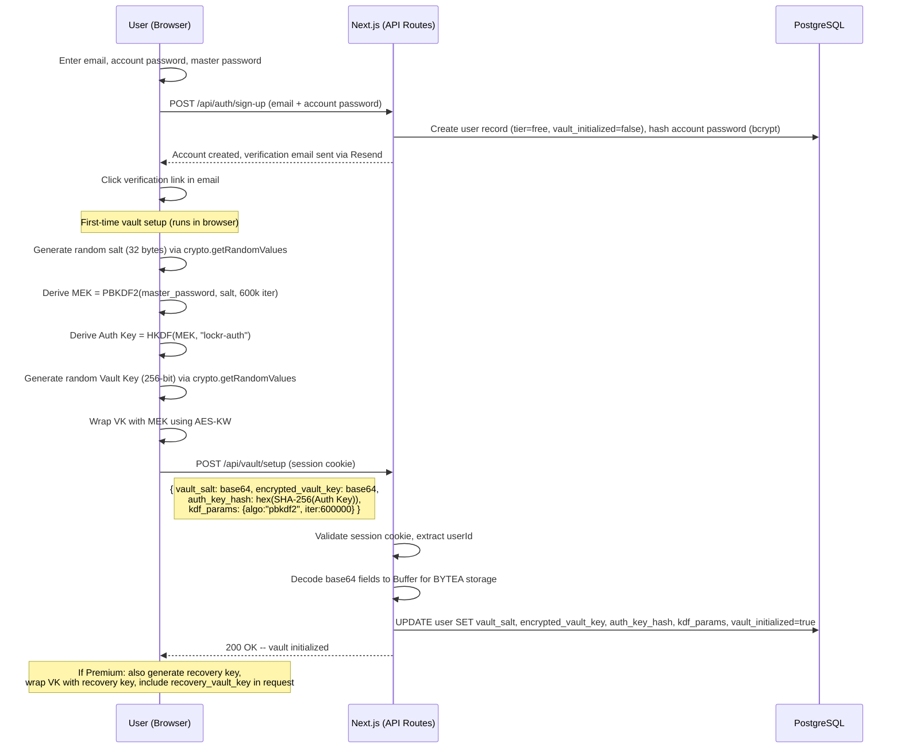
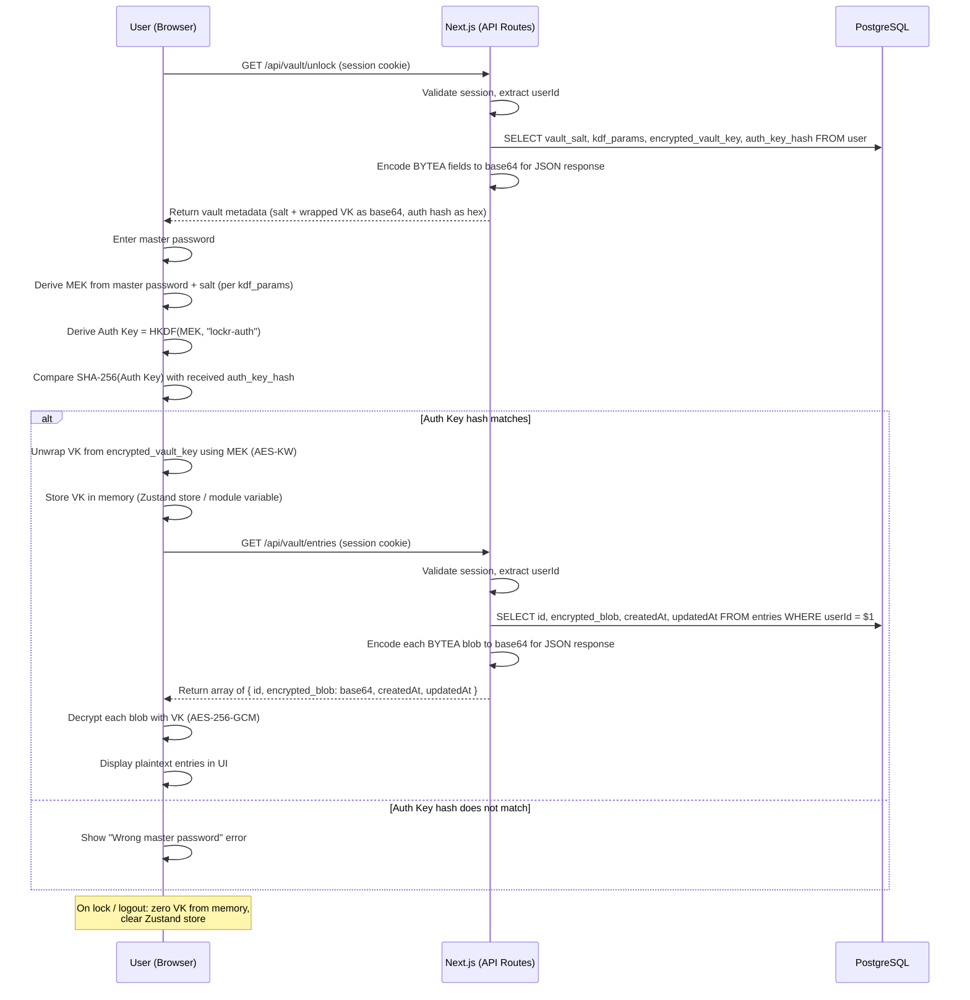
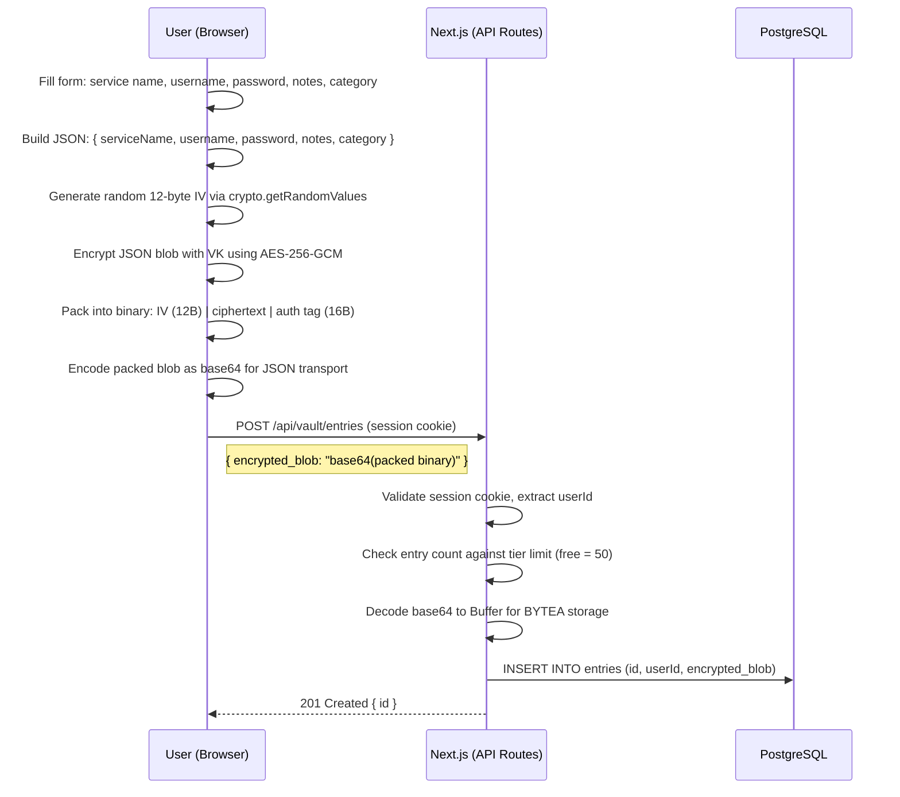
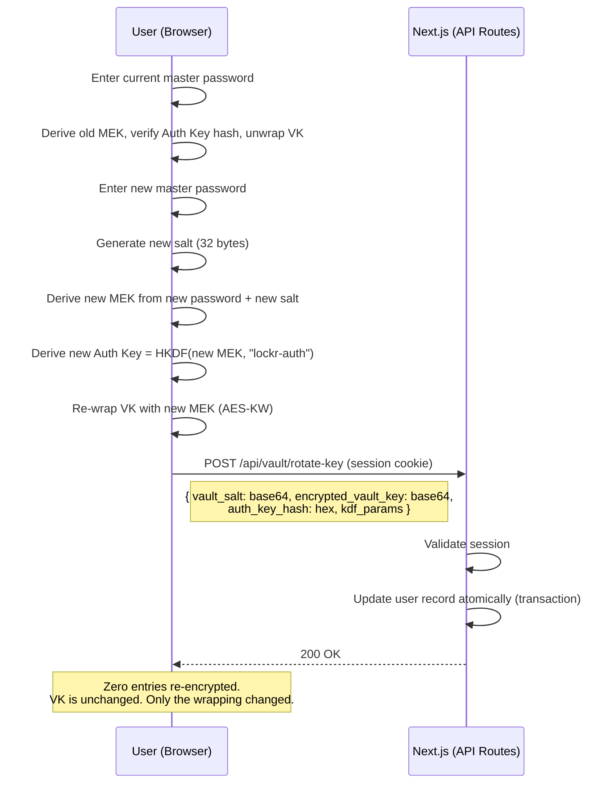
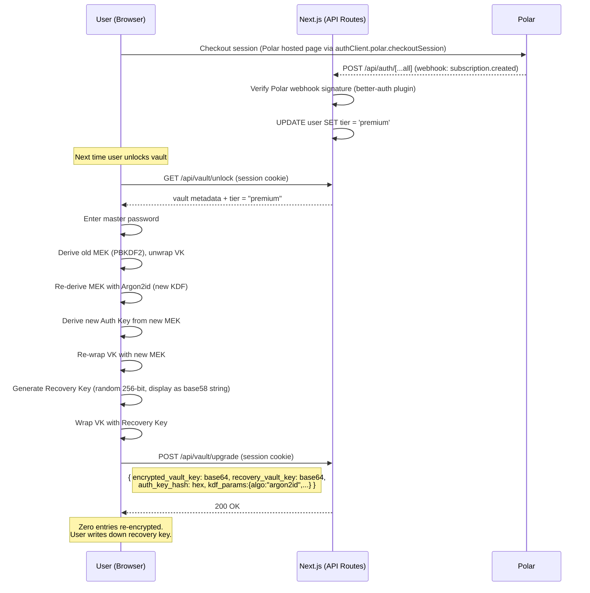

# Lockr -- Architecture & Product Overview

## What is Lockr?

Lockr is an end-to-end encrypted password manager built as a SaaS product. The server never has access to user passwords or vault contents in plaintext. All encryption and decryption happens client-side in the browser using the Web Crypto API.

Lockr uses a **vault key architecture** where a randomly generated Vault Key encrypts all entries, and the user's master password protects that Vault Key. This means changing your master password is instant (re-wrap one key) rather than re-encrypting every stored entry.

The entire application -- frontend, API, and middleware -- is a single Next.js deployment. No separate backend service.

---

## System Overview



---

## Project Structure

```
src/
  app/
    (marketing)/
      page.tsx                    -- landing page (SSR, SEO)
      pricing/page.tsx            -- pricing page (SSR, SEO)
    (auth)/
      sign-in/page.tsx
      sign-up/page.tsx
      forgot-password/page.tsx
      reset-password/page.tsx
      email-verified/page.tsx
    dashboard/
      page.tsx                    -- vault UI ("use client", all crypto here)
    api/
      auth/[...all]/route.ts      -- better-auth catch-all handler
      vault/
        setup/route.ts            -- POST: store salt, wrapped VK, auth hash, kdf_params
        unlock/route.ts           -- GET: return vault metadata for key derivation
        entries/route.ts          -- GET: fetch encrypted blobs, POST: save encrypted blob
        entries/[id]/route.ts     -- PUT: update entry, DELETE: remove entry
        rotate-key/route.ts       -- POST: re-wrap VK on master password change
        upgrade/route.ts          -- POST: swap KDF, add recovery key blob
      # Polar webhooks + checkout handled via better-auth plugin
      # in /api/auth/[...all] -- no separate route needed

  services/
    vault.service.ts              -- vault CRUD logic (framework-agnostic)
    payment.service.ts            -- tier management, Polar onPayload handler

  crypto/                         -- client-side only, imported by dashboard
    kdf.ts                        -- PBKDF2 + Argon2id wrappers (Web Crypto API)
    vault-key.ts                  -- VK generation, AES-KW wrap/unwrap
    entry-crypto.ts               -- AES-256-GCM encrypt/decrypt entry blobs
    auth-key.ts                   -- HKDF derivation of auth key from MEK
    recovery.ts                   -- recovery key generation + VK wrapping (premium)
    store.ts                      -- in-memory key store (Zustand or module scope)

  db/
    schema.ts                     -- Drizzle schema (all tables)
    drizzle.ts                    -- database connection
    migrations/                   -- Drizzle Kit generated SQL

  lib/
    auth.ts                       -- better-auth server config
    auth-client.ts                -- better-auth client
    resend.ts                     -- email service
    zod.ts                        -- shared validation schemas
    utils.ts

  middleware.ts                   -- route protection, session checks

  components/
    ui/                           -- shadcn/ui primitives
    ...                           -- app-specific components
```

**Key design rule:** API route files (`route.ts`) are thin handlers -- they parse the request, call a function in `services/`, and return a response. All business logic lives in `services/`. This keeps the door open for extracting to a separate backend later if a mobile app or browser extension is added.

---

## API Routes

All routes are Next.js API route handlers under `src/app/api/`.

| Method | Route | Auth Required | Purpose |
|--------|-------|:---:|---------|
| `*` | `/api/auth/[...all]` | No | better-auth handler (sign-up, sign-in, OAuth, email verify, password reset) |
| `POST` | `/api/vault/setup` | Yes | First-time vault init: store salt, wrapped VK, auth key hash, KDF params |
| `GET` | `/api/vault/unlock` | Yes | Return vault_salt, encrypted_vault_key, kdf_params, auth_key_hash |
| `GET` | `/api/vault/entries` | Yes | Fetch all encrypted entry blobs for the authenticated user |
| `POST` | `/api/vault/entries` | Yes | Save a new encrypted entry blob |
| `PUT` | `/api/vault/entries/[id]` | Yes | Update an existing encrypted entry blob |
| `DELETE` | `/api/vault/entries/[id]` | Yes | Delete an entry |
| `POST` | `/api/vault/rotate-key` | Yes | Master password change: store new wrapped VK + auth key hash |
| `POST` | `/api/vault/upgrade` | Yes | Tier upgrade: swap KDF params, add recovery vault key blob |
| `POST` | `/api/auth/[...all]` (Polar webhook path) | No (Polar signature) | Subscription created, updated, canceled events (handled by better-auth Polar plugin) |

Session validation on "Auth Required" routes: middleware extracts the session cookie, verifies it against the `session` table, and injects the authenticated `userId` into the request. The API route handler never trusts a client-sent `userId` -- it always uses the session-verified identity.

---

## Database Schema



**What changed from the current schema:** the `passwords` table (with plaintext `username`, `serviceName`, `notes` columns) is replaced by `entries` with a single opaque `encrypted_blob` column. All metadata lives inside the encrypted blob -- the server cannot read any of it.

### Storage Encoding

All binary data (`vault_salt`, `encrypted_vault_key`, `recovery_vault_key`, `encrypted_blob`) is stored as PostgreSQL `BYTEA` -- raw bytes, no encoding overhead on disk. The `auth_key_hash` is stored as `TEXT` (hex-encoded SHA-256 hash) since it is used for string comparison on the server.

For API transport (JSON responses/requests), binary fields are base64-encoded. The base64 overhead (33%) exists only in transit, not at rest.

**Encrypted blob binary layout** (no delimiters, fixed-position fields):

```
| IV (12 bytes) | Ciphertext (variable) + Auth Tag (16 bytes, appended by Web Crypto) |
|---------------|----------------------------------------------------------------------|
| Fixed offset  | crypto.subtle.encrypt output (ciphertext + tag concatenated)         |
```

On decrypt, slice the first 12 bytes as IV, pass the remainder to `crypto.subtle.decrypt` which expects ciphertext + appended auth tag.

---

## Key Hierarchy

The core of Lockr's security model. Both tiers use this same structure.



**Key principle:** The server stores `Wrapped Vault Key` and `Encrypted Entry Blobs`. It cannot decrypt either without the MEK, which is derived from the master password, which never leaves the browser.

---

## Sign-Up Flow



---

## Unlock & Decrypt Flow



---

## Save Entry Flow



---

## Master Password Change Flow



---

## Tier Upgrade Flow



---

## Tier Comparison

### Vault & Storage

| Feature | Free | Premium |
|---------|:----:|:-------:|
| Encrypted vault entries | 50 | Unlimited |
| Personal vault | Yes | Yes |
| Encrypted notes (API keys, Wi-Fi, secure text) | 5 | Unlimited |
| Encrypted file attachments | -- | 1 GB |
| Custom categories and tags | 3 custom | Unlimited |
| Password history (previous versions per entry) | -- | Last 25 versions |
| Trash / recently deleted (30-day recovery) | -- | Yes |

### Security & Encryption

| Feature | Free | Premium |
|---------|:----:|:-------:|
| End-to-end encryption (AES-256-GCM + Vault Key) | Yes | Yes |
| Key Derivation Function | PBKDF2 (600k iter) | Argon2id (memory-hard) |
| Recovery key (master password backup) | -- | Yes |
| Vault health report | Score only | Full breakdown + suggestions |
| Breach monitoring (HaveIBeenPwned) | -- | Continuous + email alerts |
| 2FA for Lockr account (TOTP) | Yes | Yes |
| 2FA for Lockr account (FIDO2 / hardware keys) | -- | Yes |

### Convenience & Productivity

| Feature | Free | Premium |
|---------|:----:|:-------:|
| Password generator | Basic | Advanced (passphrase, rules) |
| Built-in TOTP authenticator | -- | Yes |
| Browser extension (future) | Yes | Yes |
| Active sessions / devices | 2 | Unlimited |
| Autofill (future) | Yes | Yes |
| Secure sharing (one-to-one, future) | -- | 5 active shares |
| Import from other password managers | Yes | Yes |
| Export vault (encrypted backup) | Yes | Yes |

### Support

| Feature | Free | Premium |
|---------|:----:|:-------:|
| Community support | Yes | Yes |
| Email support | -- | Priority |
| Early access to new features | -- | Yes |

### Future: Family Plan

| Feature | Family |
|---------|:------:|
| Up to 6 members | Yes |
| Shared collections with per-member permissions | Yes |
| Emergency access (trusted contact, time-delayed) | Yes |
| Family admin dashboard | Yes |
| Activity log for shared vaults | Yes |

---

## What the Server Stores vs. What It Knows

This is the zero-knowledge guarantee.

| Data | Stored on Server | Server Can Read It |
|------|:---:|:---:|
| Email, name | Yes | Yes |
| Account password (bcrypt hash) | Yes | No (hashed) |
| Master password | **No** | **Never sent** |
| Vault salt | Yes | Yes (not secret, per-user randomness) |
| KDF parameters | Yes | Yes (not secret, algorithm config) |
| Auth Key hash | Yes | Yes (verification only, cannot reverse to MEK) |
| Wrapped Vault Key | Yes | No (encrypted with MEK) |
| Recovery Vault Key blob | Yes | No (encrypted with recovery key) |
| Encrypted entry blobs | Yes | No (encrypted with VK) |
| Entry metadata (service name, username, notes) | **No** (inside encrypted blob) | No |

---

## Tech Stack

| Layer | Technology |
|-------|-----------|
| Framework | Next.js 15 (App Router) -- single deployment for UI + API |
| UI | React 19, TypeScript (strict), Tailwind CSS v4, shadcn/ui, Radix |
| Forms | react-hook-form + zod |
| Data fetching | TanStack Query (React Query) |
| Client state (key store) | Zustand (in-memory only, never persisted) |
| URL state | nuqs (type-safe search params -- filters, categories, pagination) |
| Client-side crypto | Web Crypto API (SubtleCrypto) -- native, no polyfills |
| Premium KDF | Argon2id via WASM (hash-wasm), dynamically imported |
| Authentication | better-auth (session-based, secure httpOnly cookies) |
| Database | PostgreSQL on Neon (serverless, connection pooling) |
| ORM | Drizzle ORM + Drizzle Kit (migrations) |
| Validation | zod (shared between client and API routes) |
| Email | Resend + React Email templates |
| Payments | Polar (better-auth plugin -- checkout, customer portal, webhooks, tax compliance) |
| Hosting | Vercel (single deployment) |
| Monitoring | Sentry (errors), PostHog (privacy-friendly analytics) |
| Testing | Vitest (unit/crypto), Playwright (E2E) |

---

## Security Properties

1. **End-to-end encrypted** -- the server stores only ciphertext and cannot decrypt vault contents
2. **Zero-knowledge authentication** -- the server verifies an Auth Key derivative, never the master password itself
3. **Per-user salt** -- identical master passwords produce different keys for different users
4. **Authenticated encryption** -- AES-256-GCM provides both confidentiality and integrity (tamper detection)
5. **Key hierarchy** -- master password change is O(1), not O(n) entries
6. **Memory-only key storage** -- VK and MEK live in JavaScript memory (Zustand store), never in localStorage, cookies, or IndexedDB
7. **Forward secrecy on lock** -- when the vault is locked, key material is zeroed; re-entry of master password is required to decrypt again
8. **Server-side session validation** -- API routes never trust client-sent userId; identity is always extracted from the validated session cookie
9. **Tier-enforced limits** -- entry count limits are enforced server-side, not client-side
